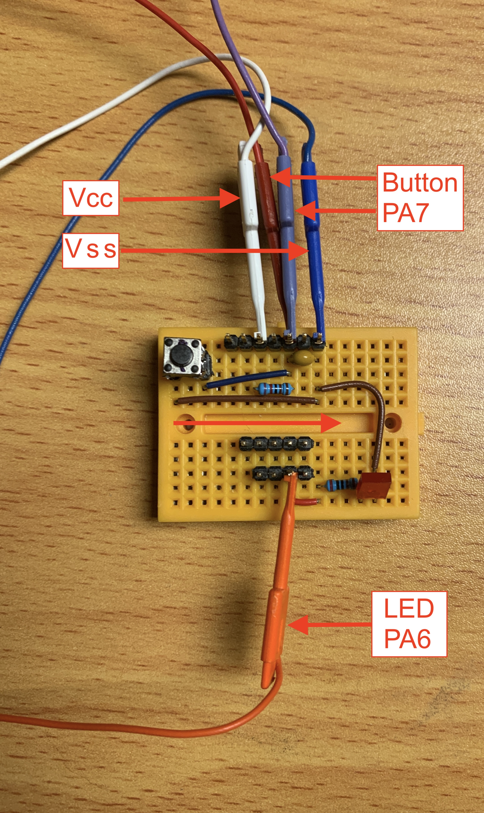

# A Simple SYM-1 (6502) IRQ Initialization and Processing Demo

## Overview

Below is a photo an overview of the hardware setup for this demo.  
As can be seen, there is not much to it.
* 0.1 microfarid capacitor
* 2K resistor
* 2.2K resistor
* Momentary switch (button)
* LED 5v
* Small protoboard
* SYM-1 Board with Monitor V1.1

On the SYM-1 **AA-Connector**, the following lines were used  
* CA1 <--> "P"
* PA6 <--> "17"
* PA7 <--> "U"
* Vcc <--> "A"
* Vss <--> "1"
  
 

Below is a screenshot of a logic analyzer capture, showing the results of 3 button press/release cycles.
Note that the LED is not toggled on the button press phase, but rather on the button release phase.  

 
